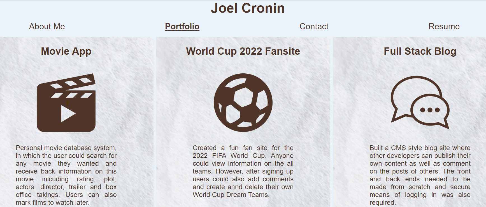

# React Portfolio

In this project, I used my knowledge of React to build a portfolio that I can present to employers for my upcoming job search. It has four sections:

* About Me
* Completed Projects 
* Contact
* Resume

I used the component, props and states functionality provided by React to add some dynamism to the portfolio and enjoyed the process of making this site.

## Table of Contents

[Installation](#installation)

[Usage](#usage)

[Contributing](#contributing)

[License](#license)

[Questions](#questions)

[Links](#links)

## Installation

To install this you will need to run: 'npm i' 

## Usage

To start this locally you will need to run npm start.

## Contributing

To contribute to this, clone the repo locally and commit on a seperate branch

## License

This application is covered under the following license: The Unlicence

## Links

You can see the deployed version of this by [clicking here](https://joelcronin.github.io/cautious-dollop/)

